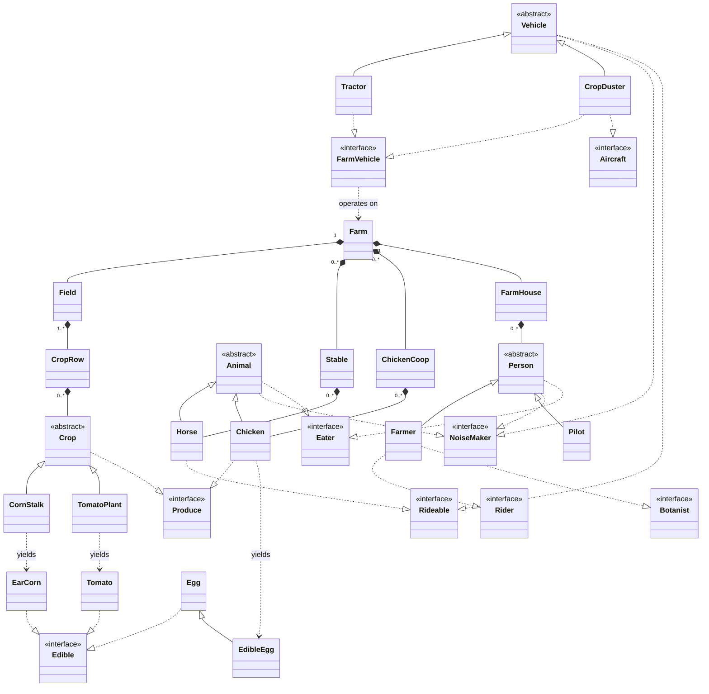

```mermaid
classDiagram
direction TB

    %% =========================
    %% INTERFACES
    %% =========================

    class Eater {
        <<interface>>
    }

    class Edible {
        <<interface>>
    }

    class NoiseMaker {
        <<interface>>
    }

    class Rideable {
        <<interface>>
    }

    class Rider {
        <<interface>>
    }

    class Botanist {
        <<interface>>
    }

    class Produce {
        <<interface>>
    }

    class FarmVehicle {
        <<interface>>
    }

    class Aircraft {
        <<interface>>
    }


    %% =========================
    %% PEOPLE
    %% =========================

    class Person {
        <<abstract>>
    }

    class Farmer

    class Pilot

    Person <|-- Farmer
    Person <|-- Pilot

    Person ..|> NoiseMaker
    Person ..|> Eater

    Farmer ..|> Rider
    Farmer ..|> Botanist


    %% =========================
    %% ANIMALS
    %% =========================

    class Animal {
        <<abstract>>
    }

    class Horse

    class Chicken

    Animal <|-- Horse
    Animal <|-- Chicken

    Animal ..|> NoiseMaker
    Animal ..|> Eater

    Horse ..|> Rideable
    Chicken ..|> Produce


    %% =========================
    %% VEHICLES
    %% =========================

    class Vehicle {
        <<abstract>>
    }

    class Tractor

    class CropDuster

    Vehicle <|-- Tractor
    Vehicle <|-- CropDuster

    Vehicle ..|> NoiseMaker
    Vehicle ..|> Rideable

    Tractor ..|> FarmVehicle
    CropDuster ..|> FarmVehicle
    CropDuster ..|> Aircraft

    FarmVehicle ..> Farm : operates on


    %% =========================
    %% CROPS
    %% =========================

    class Crop {
        <<abstract>>
    }

    class CornStalk

    class TomatoPlant

    Crop <|-- CornStalk
    Crop <|-- TomatoPlant

    Crop ..|> Produce

    CornStalk ..> EarCorn : yields
    TomatoPlant ..> Tomato : yields


    %% =========================
    %% EDIBLES
    %% =========================

    class Egg

    class EdibleEgg

    class EarCorn

    class Tomato

    Egg ..|> Edible
    Egg <|-- EdibleEgg

    EarCorn ..|> Edible
    Tomato ..|> Edible

    Chicken ..> EdibleEgg : yields


    %% =========================
    %% FARM STRUCTURE
    %% =========================

    class Farm

    class Field

    class CropRow

    class Stable

    class ChickenCoop

    class FarmHouse

    Farm "1" *-- Field
    Farm "0..*" *-- Stable
    Farm "0..*" *-- ChickenCoop
    Farm "1" *-- FarmHouse

    Field "1..*" *-- CropRow
    CropRow "0..*" *-- Crop

    Stable "0..*" *-- Horse
    ChickenCoop "0..*" *-- Chicken
    FarmHouse "0..*" *-- Person
```